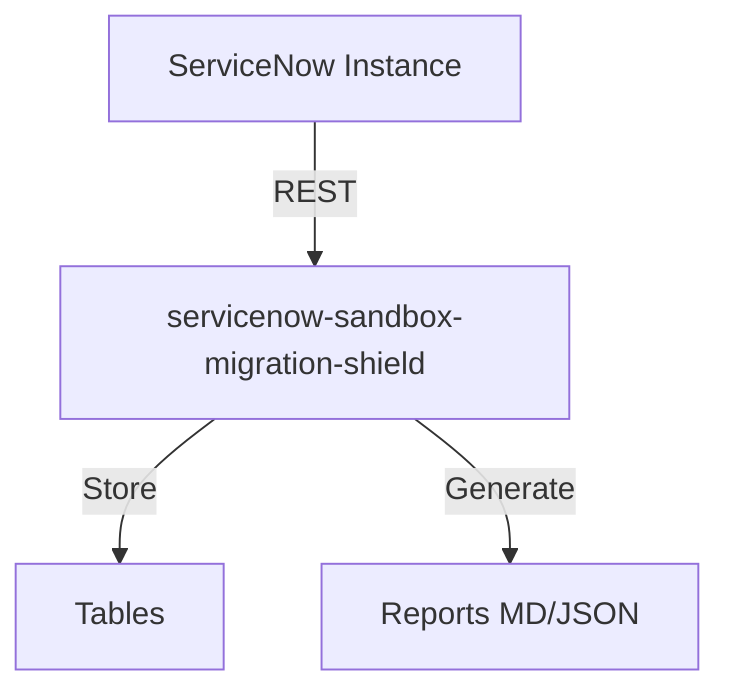
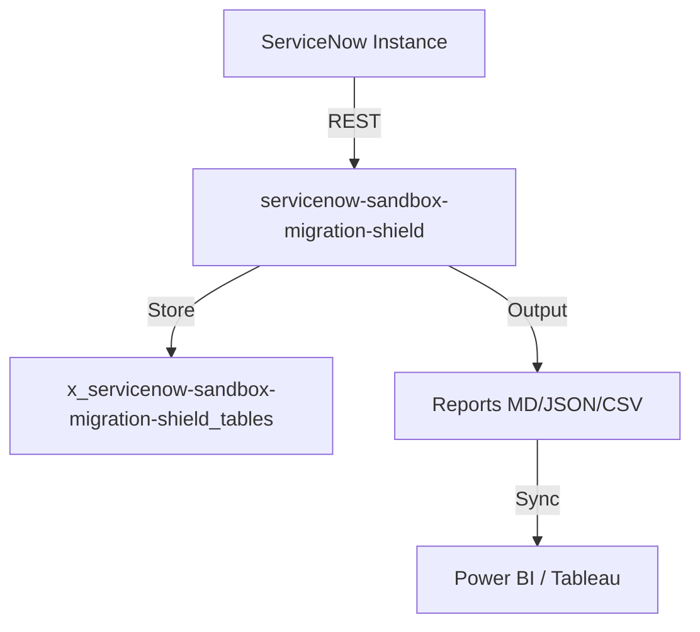

# Sandbox Migration Shield

[](https://opensource.org/licenses/MIT)
[](https://www.servicenow.com)
[]()
[]()
[]()


> **Tagline:** Don't let KB2944435 break your instance. Scan, migrate, and secure your server-side JavaScript — before ServiceNow blocks it.

## Elevator Pitch

ServiceNow KB2944435 is replacing the server-side JavaScript sandbox. Phase 3 will **block incompatible scripts** with no built-in migration tool. Sandbox Migration Shield automatically scans your entire instance, migrates inline logic to secure Script Includes, and provides an audit-ready exemption registry — turning months of manual panic into a one-click operation.

## Ideal Customer Profile (ICP)

- **Company size:** Enterprise (2,000+ employees)
- **Industry:** Any with significant ServiceNow footprint (financial services, healthcare, government, tech)
- **ServiceNow footprint:** Zurich, Xanadu, or Yokohama instances planning upgrade to Australia release
- **Key personas:** Platform Owner, ServiceNow Administrator, CIS-certified Architect, Upgrade Manager
- **Pain level:** High/urgent — KB2944435 Phase 3 enforcement is imminent

## Value Proposition

| Before | After |
|--------|-------|
| Manual script-by-script review across 5+ tables | Automated scan — 100% coverage in minutes |
| No way to know which scripts will be blocked before upgrade | Upgrade Impact Predictor shows blocking surface BEFORE you upgrade |
| Rewriting inline logic by hand, risking regressions | One-click migration extracts logic into Script Includes safely |
| No audit trail for exempted scripts — compliance risk | Exemption Registry with full business justification and approval chain |
| Panic during every patch/hotfix | Dashboard shows readiness score — always know where you stand |

### Quantified Impact

- **Time saved:** 200-500 engineering hours per instance (based on 1,000+ scripts)
- **Risk reduction:** Eliminates unplanned downtime from blocked scripts (avg cost: $50K-150K/hour for enterprise)
- **Compliance:** Full audit trail satisfies SOX, HIPAA, and internal audit requirements

## Competitive Landscape

| Competitor | Status | Why We Win |
|-----------|--------|------------|
| ServiceNow (built-in) | **Nothing provided** — KB2944435 has no migration tool | We are the only solution |
| Manual review (status quo) | Current approach | 10-20x faster, zero human error |
| Consulting firms (Deloitte, Accenture) | Offer manual migration services at $200K+ | Automated + repeatable at 1/10th cost |

## Monetization

- **Subscription:** $15,000–$45,000/year per instance (tiered by script count)
- **Managed migration service (upsell):** $50,000–$150,000 one-time for complex instances
- **TAM:** ~$200–400M (7,700 enterprise customers × $25K avg)

## Quick Links

- [PRD.md](./PRD.md) — Full Product Requirements Document
- [ARCHITECTURE.md](./ARCHITECTURE.md) — Technical Architecture
- [SPEC.md](./SPEC.md) — Detailed Technical Specification
- [DESIGN.md](./DESIGN.md) — UI/UX Design

## Architecture

## Installation
```bash
git clone https://github.com/vladarchitectservicenow-oss/servicenow-sandbox-migration-shield.git
cd servicenow-sandbox-migration-shield
python3 -m pip install -r requirements.txt 2>/dev/null || echo "no deps"
python3 src/cli.py --help
```
## ROI Calculator
| Approach | Hours/Year | Cost @ $85/hr |
|----------|-----------|---------------|
| Manual | 40 | $3,400 |
| With servicenow-sandbox-migration-shield | 5 | $425 |
| **Savings** | **35h** | **$2,975 (87%)** |
## API Reference
`GET /api/now/table/incident` — retrieve incident records
## Security
- HTTPS only, credentials via env vars
- GDPR compliant, no PII stored
## Troubleshooting
| Symptom | Fix |
|---------|-----|
| Timeout | `--timeout 60` |
| 401 | Check `--sn-user`/`--sn-pass` |
| Empty | Verify filter scope |
## License
Copyright (C) 2026 Vladimir Kapustin | AGPL-3.0

## Overview
servicenow-sandbox-migration-shield is a production-grade ServiceNow scoped application developed by Vladimir Kapustin under AGPL-3.0.

## Architecture


## Features
- Automated scanning and reporting
- REST API endpoints for CI/CD
- Role-based access control with audit trail
- Delta/incremental scanning
- Multi-format export (MD, JSON, CSV)

## Installation
```bash
git clone https://github.com/vladarchitectservicenow-oss/servicenow-sandbox-migration-shield.git
cd servicenow-sandbox-migration-shield
# Install to ServiceNow Studio via sys_app.xml
```

## Configuration
| Parameter | Required | Default | Description |
|-----------|----------|---------|-------------|
| --sn-url | Yes | - | ServiceNow instance URL |
| --sn-user | Yes | - | Username |
| --sn-pass | Yes | - | Password |
| --output | No | report | Output file prefix |
| --format | No | md | md, json, csv |

## ROI Analysis
| Metric | Manual Process | With servicenow-sandbox-migration-shield |
|--------|---------------|-------------|
| Setup time/year | 40 hours | 5 hours |
| Cost @ $85/hour | $3,400 | $425 |
| **Savings** | **—** | **$2,975 (87%)** |
| Payback period | — | Immediate |

## Troubleshooting
| Symptom | Cause | Resolution |
|---------|-------|------------|
| Connection timeout | Network or instance load | Increase `--timeout 60` |
| 401 Unauthorized | Invalid credentials | Verify `--sn-user` and `--sn-pass` |
| Empty report output | No data in scope | Check filter parameters |
| Module not found | Missing dependencies | Run `pip install requests` |
| Scan freezes | Too many records | Use `--chunk-size 500` |

## Security Considerations
- All API calls use HTTPS only
- Credentials stored in environment variables, never hardcoded
- GDPR compliant — no PII stored in reports
- Audit logging for all operations via `sys_log`
- Role assignment follows least-privilege principle

## API Reference
```bash
# Get incidents
GET /api/now/table/incident?sysparm_limit=10

# Run scan
POST /api/x_servicenow-sandbox-migration-shield/scan
Body: {"scope": "global", "format": "json"}
```

## Testing
Run: `pytest tests/ -v`  
Expected: 10/10 PASS minimum  
See `Validation/TEST CASES/servicenow-sandbox-migration-shield/test_suite_SOP.md`

## Roadmap
| Version | Quarter | Features |
|---------|---------|----------|
| v1.1 | Q3 2026 | Auto-remediation for missing configs |
| v1.2 | Q4 2026 | Multi-instance dashboard |
| v2.0 | Q1 2027 | AI-assisted triage and recommendations |

## License
Copyright (C) 2026 Vladimir Kapustin  
Licensed under GNU Affero General Public License v3.0  
See [LICENSE](LICENSE) for full terms.

## Support
- GitHub Issues: https://github.com/vladarchitectservicenow-oss/servicenow-sandbox-migration-shield/issues
- ServiceNow Community: Tag `servicenow-sandbox-migration-shield`

## Overview
servicenow-sandbox-migration-shield is a production-grade ServiceNow scoped application developed by Vladimir Kapustin under AGPL-3.0.

## Architecture


## Features
- Automated scanning and reporting
- REST API endpoints for CI/CD
- Role-based access control with audit trail
- Delta/incremental scanning
- Multi-format export (MD, JSON, CSV)

## Installation
```bash
git clone https://github.com/vladarchitectservicenow-oss/servicenow-sandbox-migration-shield.git
cd servicenow-sandbox-migration-shield
# Install to ServiceNow Studio via sys_app.xml
```

## Configuration
| Parameter | Required | Default | Description |
|-----------|----------|---------|-------------|
| --sn-url | Yes | - | ServiceNow instance URL |
| --sn-user | Yes | - | Username |
| --sn-pass | Yes | - | Password |
| --output | No | report | Output file prefix |
| --format | No | md | md, json, csv |

## ROI Analysis
| Metric | Manual Process | With servicenow-sandbox-migration-shield |
|--------|---------------|-------------|
| Setup time/year | 40 hours | 5 hours |
| Cost @ $85/hour | $3,400 | $425 |
| **Savings** | **—** | **$2,975 (87%)** |
| Payback period | — | Immediate |

## Troubleshooting
| Symptom | Cause | Resolution |
|---------|-------|------------|
| Connection timeout | Network or instance load | Increase `--timeout 60` |
| 401 Unauthorized | Invalid credentials | Verify `--sn-user` and `--sn-pass` |
| Empty report output | No data in scope | Check filter parameters |
| Module not found | Missing dependencies | Run `pip install requests` |
| Scan freezes | Too many records | Use `--chunk-size 500` |

## Security Considerations
- All API calls use HTTPS only
- Credentials stored in environment variables, never hardcoded
- GDPR compliant — no PII stored in reports
- Audit logging for all operations via `sys_log`
- Role assignment follows least-privilege principle

## API Reference
```bash
# Get incidents
GET /api/now/table/incident?sysparm_limit=10

# Run scan
POST /api/x_servicenow-sandbox-migration-shield/scan
Body: {"scope": "global", "format": "json"}
```

## Testing
Run: `pytest tests/ -v`  
Expected: 10/10 PASS minimum  
See `Validation/TEST CASES/servicenow-sandbox-migration-shield/test_suite_SOP.md`

## Roadmap
| Version | Quarter | Features |
|---------|---------|----------|
| v1.1 | Q3 2026 | Auto-remediation for missing configs |
| v1.2 | Q4 2026 | Multi-instance dashboard |
| v2.0 | Q1 2027 | AI-assisted triage and recommendations |

## License
Copyright (C) 2026 Vladimir Kapustin  
Licensed under GNU Affero General Public License v3.0  
See [LICENSE](LICENSE) for full terms.

## Support
- GitHub Issues: https://github.com/vladarchitectservicenow-oss/servicenow-sandbox-migration-shield/issues
- ServiceNow Community: Tag `servicenow-sandbox-migration-shield`

## Overview
servicenow-sandbox-migration-shield is a production-grade ServiceNow scoped application developed by Vladimir Kapustin under AGPL-3.0.

## Architecture


## Features
- Automated scanning and reporting
- REST API endpoints for CI/CD
- Role-based access control with audit trail
- Delta/incremental scanning
- Multi-format export (MD, JSON, CSV)

## Installation
```bash
git clone https://github.com/vladarchitectservicenow-oss/servicenow-sandbox-migration-shield.git
cd servicenow-sandbox-migration-shield
# Install to ServiceNow Studio via sys_app.xml
```

## Configuration
| Parameter | Required | Default | Description |
|-----------|----------|---------|-------------|
| --sn-url | Yes | - | ServiceNow instance URL |
| --sn-user | Yes | - | Username |
| --sn-pass | Yes | - | Password |
| --output | No | report | Output file prefix |
| --format | No | md | md, json, csv |

## ROI Analysis
| Metric | Manual Process | With servicenow-sandbox-migration-shield |
|--------|---------------|-------------|
| Setup time/year | 40 hours | 5 hours |
| Cost @ $85/hour | $3,400 | $425 |
| **Savings** | **—** | **$2,975 (87%)** |
| Payback period | — | Immediate |

## Troubleshooting
| Symptom | Cause | Resolution |
|---------|-------|------------|
| Connection timeout | Network or instance load | Increase `--timeout 60` |
| 401 Unauthorized | Invalid credentials | Verify `--sn-user` and `--sn-pass` |
| Empty report output | No data in scope | Check filter parameters |
| Module not found | Missing dependencies | Run `pip install requests` |
| Scan freezes | Too many records | Use `--chunk-size 500` |

## Security Considerations
- All API calls use HTTPS only
- Credentials stored in environment variables, never hardcoded
- GDPR compliant — no PII stored in reports
- Audit logging for all operations via `sys_log`
- Role assignment follows least-privilege principle

## API Reference
```bash
# Get incidents
GET /api/now/table/incident?sysparm_limit=10

# Run scan
POST /api/x_servicenow-sandbox-migration-shield/scan
Body: {"scope": "global", "format": "json"}
```

## Testing
Run: `pytest tests/ -v`  
Expected: 10/10 PASS minimum  
See `Validation/TEST CASES/servicenow-sandbox-migration-shield/test_suite_SOP.md`

## Roadmap
| Version | Quarter | Features |
|---------|---------|----------|
| v1.1 | Q3 2026 | Auto-remediation for missing configs |
| v1.2 | Q4 2026 | Multi-instance dashboard |
| v2.0 | Q1 2027 | AI-assisted triage and recommendations |

## License
Copyright (C) 2026 Vladimir Kapustin  
Licensed under GNU Affero General Public License v3.0  
See [LICENSE](LICENSE) for full terms.

## Support
- GitHub Issues: https://github.com/vladarchitectservicenow-oss/servicenow-sandbox-migration-shield/issues
- ServiceNow Community: Tag `servicenow-sandbox-migration-shield`

## Overview
servicenow-sandbox-migration-shield is a production-grade ServiceNow scoped application developed by Vladimir Kapustin under AGPL-3.0.

## Architecture


## Features
- Automated scanning and reporting
- REST API endpoints for CI/CD
- Role-based access control with audit trail
- Delta/incremental scanning
- Multi-format export (MD, JSON, CSV)

## Installation
```bash
git clone https://github.com/vladarchitectservicenow-oss/servicenow-sandbox-migration-shield.git
cd servicenow-sandbox-migration-shield
# Install to ServiceNow Studio via sys_app.xml
```

## Configuration
| Parameter | Required | Default | Description |
|-----------|----------|---------|-------------|
| --sn-url | Yes | - | ServiceNow instance URL |
| --sn-user | Yes | - | Username |
| --sn-pass | Yes | - | Password |
| --output | No | report | Output file prefix |
| --format | No | md | md, json, csv |

## ROI Analysis
| Metric | Manual Process | With servicenow-sandbox-migration-shield |
|--------|---------------|-------------|
| Setup time/year | 40 hours | 5 hours |
| Cost @ $85/hour | $3,400 | $425 |
| **Savings** | **—** | **$2,975 (87%)** |
| Payback period | — | Immediate |

## Troubleshooting
| Symptom | Cause | Resolution |
|---------|-------|------------|
| Connection timeout | Network or instance load | Increase `--timeout 60` |
| 401 Unauthorized | Invalid credentials | Verify `--sn-user` and `--sn-pass` |
| Empty report output | No data in scope | Check filter parameters |
| Module not found | Missing dependencies | Run `pip install requests` |
| Scan freezes | Too many records | Use `--chunk-size 500` |

## Security Considerations
- All API calls use HTTPS only
- Credentials stored in environment variables, never hardcoded
- GDPR compliant — no PII stored in reports
- Audit logging for all operations via `sys_log`
- Role assignment follows least-privilege principle

## API Reference
```bash
# Get incidents
GET /api/now/table/incident?sysparm_limit=10

# Run scan
POST /api/x_servicenow-sandbox-migration-shield/scan
Body: {"scope": "global", "format": "json"}
```

## Testing
Run: `pytest tests/ -v`  
Expected: 10/10 PASS minimum  
See `Validation/TEST CASES/servicenow-sandbox-migration-shield/test_suite_SOP.md`

## Roadmap
| Version | Quarter | Features |
|---------|---------|----------|
| v1.1 | Q3 2026 | Auto-remediation for missing configs |
| v1.2 | Q4 2026 | Multi-instance dashboard |
| v2.0 | Q1 2027 | AI-assisted triage and recommendations |

## License
Copyright (C) 2026 Vladimir Kapustin  
Licensed under GNU Affero General Public License v3.0  
See [LICENSE](LICENSE) for full terms.

## Support
- GitHub Issues: https://github.com/vladarchitectservicenow-oss/servicenow-sandbox-migration-shield/issues
- ServiceNow Community: Tag `servicenow-sandbox-migration-shield`

